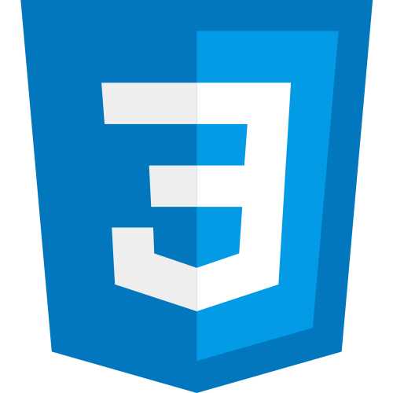
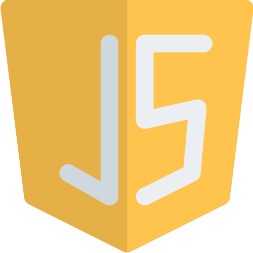

# Hello, I'm Tuğçe, 
🍄 Passionate and dedicated Front-End Developer enthusiast currently enrolled in a comprehensive Front-End Developer course. My journey into the world of web development began with a curiosity to understand how websites are built and evolved into a deep love for crafting engaging and user-friendly web experiences.  
🍄 I have acquired proficiency in HTML5, CSS, and JavaScript, laying a solid foundation for my career in web development. In addition, I am actively learning and expanding my skill set to include modern frameworks like React, which enables me to create dynamic and interactive user interfaces.  
🍄 I thrive in collaborative environments where I can contribute my creativity and problem-solving skills to drive innovative solutions. With a keen eye for design and a commitment to delivering high-quality code, I am passionate about creating seamless and impactful digital experiences.  
Outside of coding, I enjoy exploring new technologies, attending tech meetups, and staying updated with the latest trends in web development. I am eager to leverage my skills and continue growing in the dynamic field of Front-End Development.
 

<table>
  <tr>
    <td></td>
    <td></td>
    <td></td>
    <td></td>
  </tr>
</table>
